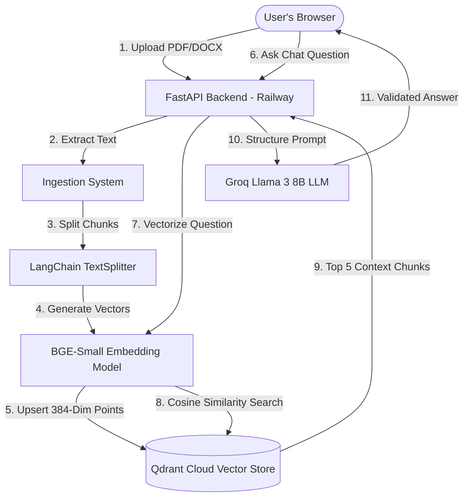

# Product Requirements Document (PRD)

## Project: Legal Document Analyzer (Legal RAG)
**Author:** AI Pair Partner  
**Status:** Draft / Ready for Review  
**Date:** May 25, 2026  
**Target Release:** MVP — Phase 1 Deployed  

---

## 1. Executive Summary

### 1.1 Problem Statement
Small business owners, freelancers, and independent contractors frequently sign legal agreements (e.g., Non-Disclosure Agreements, Commercial Leases, Service Agreements, and Vendor Contracts) without professional legal review. Retaining a lawyer for everyday contract evaluation is cost-prohibitive, leading to high-risk commitments, misunderstood clauses, and potential litigation.

### 1.2 Solution Statement
The **Legal Document Analyzer** is an AI-powered assistant designed to demystify complex legal contracts. By providing a secure, web-based portal, users can upload `.pdf` and `.docx` contracts to instantly receive:
1. An interactive, queryable chat assistant trained directly on their uploaded contract.
2. An automated, clause-by-clause risk classification dashboard highlighting high, medium, and low-risk terms.
3. Plain-English translations of dense, convoluted legalese with side-by-side comparisons.

### 1.3 High-Level Product Goals
*   **Democratize Legal Literacy:** Provide clear, readable summaries of complex agreements so non-lawyers can negotiate with confidence.
*   **Immediate Time-to-Value:** Deliver full document analysis, clause scoring, and plain-English translation in under 5 seconds.
*   **Capital-Efficient Infrastructure:** Leverage a high-performance, 100% free-tier tech stack capable of processing production-grade contract volumes.

---

## 2. Target Audience & User Personas

### 2.1 Target Audience
*   **Freelancers & Contractors:** Self-employed individuals reviewing Master Service Agreements (MSAs) or Statements of Work (SOWs).
*   **Small Business Owners:** Founders reviewing office leases, vendor contracts, or employee non-compete agreements.
*   **Procurement / Operations Teams:** In-house staff handling high-frequency standard legal documents.

### 2.2 User Personas
```
┌─────────────────────────────────────────────────────────────────────────────┐
│  PERSONA: Sarah (Freelance Software Consultant)                            │
│  "I just want to know if I am giving away my intellectual property rights   │
│  or committing to unlimited liability before I sign this contract."         │
│                                                                             │
│  Need: Fast, automated risk assessment with clear plain-English summaries.  │
│  Pain Points: Legalese makes her anxious; legal fees consume project margin.│
└─────────────────────────────────────────────────────────────────────────────┘
```

---

## 3. Scope & Feature Specifications

The MVP features are divided into critical core capabilities and post-MVP roadmap enhancements.

### 3.1 Functional Requirements (MVP)

#### FR-01: Multi-Format Document Ingestion
*   **Description:** The system must accept both PDF (`.pdf`) and Microsoft Word (`.docx`) file types.
*   **Acceptance Criteria:**
    *   Drag-and-drop file upload zone supporting active drop status.
    *   Validation rejector for formats other than `.pdf` and `.docx` with helpful error alerts.
    *   File size limit capped at 10MB to maintain free-tier compatibility.
    *   Extraction must preserve structural paragraphs, lists, and line-breaks.

#### FR-02: Retrieval-Augmented Generation (RAG) Q&A Chain
*   **Description:** An interactive chat panel that allows users to ask specific questions about their document.
*   **Acceptance Criteria:**
    *   Prompt templates must enforce strict grounding (e.g., "Use ONLY the provided context. If the answer is not in the contract, explicitly state so").
    *   Response formatting: Summary, Key Points (bullets), and Risks.
    *   Retrieval must locate the top 5 most relevant semantic chunks using cosine similarity.

#### FR-03: Automated Clause Red-Flag/Risk Detection
*   **Description:** Automated scanning of the uploaded document for high-risk legal clauses.
*   **Acceptance Criteria:**
    *   System must scan for key legal concepts: Indemnification, Termination, Liability, Governing Law, Arbitration, Non-Compete, Confidentiality, and Waivers.
    *   Categorize clauses into 3 risk bands:
        *   🔴 **High Risk:** Severe financial obligations, broad IP transfers, or one-sided liability waivers.
        *   🟡 **Medium Risk:** Narrow indemnification clauses, governing law in unfavorable jurisdictions.
        *   🟢 **Low Risk:** Balanced standard operating terms.
    *   Provide a visual breakdown showing count cards for High, Medium, and Low-risk categories.

#### FR-04: Sourced Reference / Chunk Viewer
*   **Description:** Transparent citation system that highlights where the AI fetched its answers.
*   **Acceptance Criteria:**
    *   Each chat response or risk flag must output source cards.
    *   Cards display a 200-character snippet of the exact contract text, its chunk index, and semantic retrieval score.

---

### 3.2 Feature Matrix & Priority (MoSCoW)

| Feature | Category | Priority (MoSCoW) | Description |
| :--- | :--- | :--- | :--- |
| **PDF/DOCX Parser** | Ingestion | **Must Have** | Core text parsing of raw file uploads |
| **BGE Vector Embedding** | RAG | **Must Have** | Convert parsed text chunks to 384-dim vectors |
| **Interactive Chat** | RAG | **Must Have** | User querying on specific contract terms |
| **Automated Clause Classifier** | Risk Scoring | **Must Have** | Risk detection for critical contract categories |
| **Citation System** | RAG | **Must Have** | Shows precise document chunk references |
| **Side-by-Side Viewer** | UX | **Should Have** | Original contract clause side-by-side with translation |
| **Exportable Reports** | Reporting | **Could Have** | Save risk dashboard as a downloadable PDF |
| **User Authentication** | Security | **Won't Have (MVP)** | Account creation and saved document history |
| **Streaming Responses** | Performance | **Won't Have (MVP)** | Real-time Server-Sent Events (SSE) chat responses |

---

## 4. Technical Architecture & System Data Flow

The application utilizes an ultra-efficient, lightweight decoupled architecture built for low latency and zero operation cost.



---

## 5. Non-Functional Requirements

### 5.1 Performance & Latency
*   **Retrieval Speed:** Semantic search database lookups must complete in under 200ms.
*   **End-to-End LLM Latency:** Generative Q&A responses via Llama 3 8B on Groq must be returned in under 2.5 seconds.
*   **Local Inference:** Embeddings are computed locally using `sentence-transformers` inside the FastAPI container, avoiding remote API roundtrips.

### 5.2 Scalability & Rate Limits
*   **Groq API Free Tier:** The app operates within Groq's 14,400 requests/day constraint. A token-bucket algorithm or in-memory cache should be considered if traffic scales.
*   **Qdrant Free Tier:** Operations must remain under Qdrant Cloud's free-tier limits: 1GB memory capacity (roughly 1,000,000 document vectors).

### 5.3 Security, Privacy & Data Compliance
*   **No Persistent Disk Storage:** Uploaded documents are parsed in-memory using `io.BytesIO`. No raw PDF or Word files are saved to the server's hard drive.
*   **Transport Security:** HTTPS/TLS encryption must be enforced across all API routes via Vercel and Railway.
*   **CORS Configuration:** Backend API must selectively trust only the deployment URL on Vercel and local development headers.

---

## 6. User Interface & Design Requirements

The frontend aesthetic must feel premium, using HSL-based colors, deep-contrast dark mode options, and clean layout hierarchies.

### 6.1 Color Palette System
*   **Primary Accent:** Slate Indigo (`#4F46E5` / `hsl(243, 75%, 59%)`)
*   **Background Surfaces:** Off-White (`#F9FAFB`) and Slate Light (`#F3F4F6`)
*   **Status & Risk Colors:**
    *   🔴 **High Risk:** Crimson Red (`#E24B4A` / `hsl(0, 72%, 59%)`)
    *   🟡 **Medium Risk:** Amber Orange (`#EF9F27` / `hsl(36, 86%, 54%)`)
    *   🟢 **Low Risk:** Olive Green (`#639922` / `hsl(88, 63%, 37%)`)

### 6.2 Key Layout Layouts
```
┌────────────────────────────────────────────────────────────────────────┐
│  [ Legal Document Analyzer Logo ]                [ Upload New File ]   │
├──────────────────────────────────────┬─────────────────────────────────┤
│                                      │                                 │
│  RISK CLASSIFICATION DASHBOARD       │  INTERACTIVE CONTRACT CHAT      │
│                                      │                                 │
│  ┌──────────┐┌──────────┐┌──────────┐│  🤖 What governing law applies? │
│  │ HIGH: 3  ││ MED: 5   ││ LOW: 12  ││                                 │
│  └──────────┘└──────────┘└──────────┘│  The agreement is governed by the│
│                                      │  laws of New York state.        │
│  [!] Indemnification (High Risk)     │  ─────────────────────────────  │
│  Plain English: You must pay for all │  Sources:                       │
│  legal defense costs...              │  [Chunk #3] "This Agreement..." │
│                                      │                                 │
│  [!] Termination (Medium Risk)       │  [ Ask another question...    ] │
│                                      │                                 │
└──────────────────────────────────────┴─────────────────────────────────┘
```

---

## 7. Metrics & KPIs

To validate the success of the MVP, the product will track the following operational and user-experience metrics:

*   **Document Ingestion Success Rate:** Goal of $\ge 98\%$ of uploaded PDF/DOCX files processed without parser errors.
*   **System Latency (P95):** Less than 3.0 seconds for complete Q&A roundtrips.
*   **Semantic Overlap Precision:** The top 3 retrieved vector chunks must contain the direct answer to the user's question $\ge 90\%$ of the time based on manual validation.
*   **Risk Detection Recall:** System must successfully flag high-risk terms (e.g., broad indemnity or unilateral termination) in standard contracts with $\ge 95\%$ accuracy.
