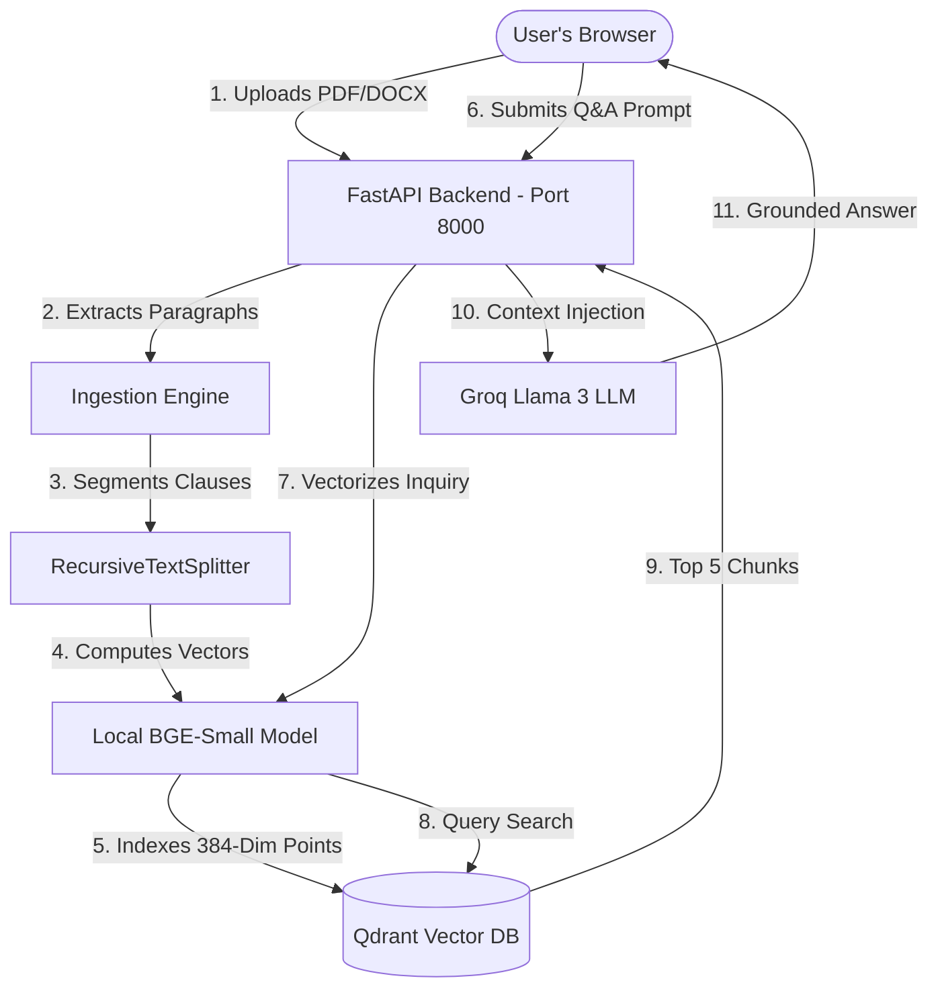

# 🛡️ Legal Agreement Diagnostics & RAG Assistant

[](https://fastapi.tiangolo.com)
[](https://react.dev)
[](https://qdrant.tech)
[](https://groq.com)
[](LICENSE)

An AI-powered **Legal Contract Analyst** built for small businesses, freelancers, and legal offices to demystify complex contracts (NDAs, leases, MSAs). Features interactive semantic querying and automated clause-by-clause risk profiling using a RAG pipeline.

---

## ✨ Core Features

*   **📄 Dual-Format Ingestion:** Seamlessly upload and parse `.pdf` (via `pypdf`) and `.docx` (via `python-docx`) agreements directly in-memory (no raw files are stored on server disks).
*   **🔴 Automated Risk Diagnostics:** Scans contracts and automatically scores terms into **High**, **Medium**, and **Low** risk categories.
*   **🔍 Interactive Citation Jumping:** Clicking any risk-scored card in the dashboard automatically highlights and scrolls to the exact matching clause in the **Reference Citations** viewer below.
*   **🤖 Grounded RAG Chat Panel:** Dialogue with a dedicated legal AI agent whose prompts enforce strict contextual grounding to prevent hallucinations.
*   **⚡ Ultra-Fast Local Embeddings:** Vectors are processed locally in the container using `BAAI/bge-small-en-v1.5` (384-dimensional cosine similarity), achieving sub-200ms vector search lookups.
*   **☁️ Dual-Mode Connection:** 
    *   *Production:* Hooks into remote **Qdrant Cloud** clusters and **Groq Llama 3 8B** models.
    *   *Developer (Offline):* Fallback to local **in-memory Qdrant** and a **heuristic rule-engine** to run the complete interface offline without needing credentials.

---

## 🛠️ Technology Stack

| Component | Technology | Description |
| :--- | :--- | :--- |
| **Frontend** | `React` + `Vite` | Fast SPA rendering with HSL dark-mode aesthetics |
| **Backend** | `FastAPI` + `Uvicorn` | Asynchronous Python REST endpoints |
| **Vector DB** | `Qdrant` | Dual-mode similarity storage (Cloud / In-Memory) |
| **Embeddings** | `SentenceTransformers` | Local `BAAI/bge-small-en-v1.5` models |
| **Reasoning LLM** | `Llama 3 8B via Groq` | Fast, low-latency API inference |
| **RAG Orchestrator** | `LangChain` | Grounded system prompt chains |

---

## 📐 System Architecture & Data Flow



---

## 📂 Repository Structure

```
├── backend/
│   ├── main.py               # API routes, CORS configs, startup logic
│   ├── ingestion.py          # PDF/Word text parsing & local embeddings
│   ├── retrieval.py          # Semantic similarity search & LLM prompt chaining
│   ├── classifier.py         # Automated risk profiling & heuristic rule engine
│   ├── models.py             # Pydantic schema declarations
│   ├── generate_test_data.py # Script generating 25 mock contracts
│   └── requirements.txt      # Python package list
├── frontend/
│   ├── src/
│   │   ├── components/       # UploadZone, RiskDashboard, ChatPanel, SourceViewer
│   │   ├── App.jsx           # Main routing & state manager
│   │   ├── api.js            # Axios endpoint client with progress monitoring
│   │   └── index.css         # Harmonious HSL styling & animations
│   └── package.json          # React node package dependencies
└── test_documents/           # Directory housing generated Word agreements
```

---

## 🚀 Quick Start & Setup

### 1. Backend Setup

First, navigate to the `backend/` directory:
```bash
cd backend
```

Create your active environment configuration:
```bash
cp .env.example .env
```
Open `.env` and fill in your keys:
```env
PORT=8000
GROQ_API_KEY=your_groq_api_key
QDRANT_URL=https://xxxxxxxx.aws.cloud.qdrant.io:6333
QDRANT_API_KEY=your_qdrant_api_key
```
*(If left blank, the system automatically falls back to offline Developer Mock Mode using local memory).*

Install Python dependencies:
```bash
pip install -r requirements.txt
```

Launch the FastAPI server:
```bash
python -m uvicorn main:app --reload --port 8000
```

---

### 2. Frontend Setup

In a new terminal window, navigate to the `frontend/` directory:
```bash
cd frontend
```

Install React packages:
```bash
npm install
```

Start the Vite development server:
```bash
npm run dev
```

Open [http://localhost:5173/](http://localhost:5173/) in your web browser and enjoy the glowing diagnostics portal!

---

## 🧪 Testing with Mock Agreements

To evaluate the system, we have generated **25 distinct agreements** featuring intentional legal risks (e.g. broad unilateral indemnity, worldwide 5-year non-competes, mandatory AAA arbitration).

1. Find the generated documents in your [test_documents/](file:///Users/parvashah/Desktop/DS%20Projects/Legal%20Document%20Analyzer/test_documents) folder.
2. Drag and drop any agreement (e.g. `02_independent_contractor_agreement.docx`) into the upload drop-zone.
3. Watch the automated scanner categorize clauses and click cards to scroll to citations immediately!

---

## 📄 License
This project is licensed under the MIT License - see the LICENSE file for details.
